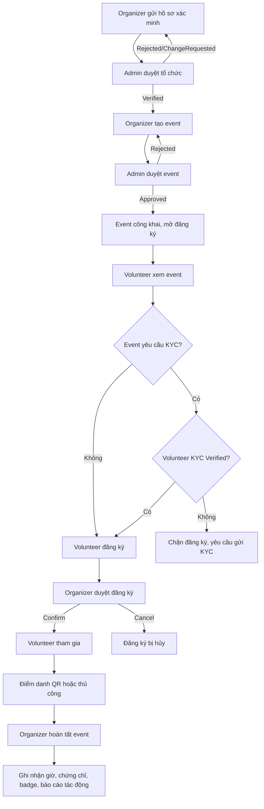

# Đặc tả luồng đăng ký và tham gia sự kiện - Volunteer Hub

## 1. Mục tiêu

Tài liệu này mô tả đầy đủ luồng nghiệp vụ từ lúc nhà tổ chức tạo sự kiện, admin duyệt, tình nguyện viên đăng ký, nhà tổ chức xét duyệt người tham gia, điểm danh, hoàn tất sự kiện và ghi nhận kết quả.

Mục tiêu thiết kế:

- Sự kiện chỉ được công khai sau khi nhà tổ chức hợp lệ và admin duyệt.
- Volunteer có thể tìm sự kiện phù hợp theo kỹ năng, địa điểm, thời gian và điều kiện KYC.
- Organizer kiểm soát danh sách đăng ký, ca làm việc, điểm danh và kết thúc sự kiện.
- Hệ thống ghi nhận giờ tình nguyện, chứng chỉ, badge và lịch sử tham gia một cách minh bạch.

## 2. Actor

### 2.1. Volunteer

Người dùng cá nhân tham gia hoạt động tình nguyện.

Volunteer có thể:

- Cập nhật hồ sơ cá nhân.
- Khai báo kỹ năng/ngôn ngữ.
- Gửi minh chứng kỹ năng để admin xác minh.
- Gửi KYC tùy chọn.
- Tìm và đăng ký sự kiện.
- Chọn ca làm việc nếu sự kiện có ca.
- Rút đăng ký khi chưa được xác nhận.
- Tự điểm danh bằng QR nếu đã được xác nhận.
- Xem lịch sử tham gia, giờ tình nguyện, chứng chỉ và badge.

### 2.2. Organizer

Tài khoản tổ chức/câu lạc bộ chịu trách nhiệm tạo và vận hành sự kiện.

Organizer có thể:

- Gửi hồ sơ xác minh tổ chức.
- Tạo/sửa/xóa sự kiện khi đã được xác minh hợp lệ.
- Cấu hình kỹ năng yêu cầu, số người tối thiểu/tối đa, yêu cầu KYC, địa điểm, ảnh, thời gian.
- Quản lý danh sách đăng ký.
- Xác nhận hoặc từ chối volunteer.
- Tạo ca làm việc.
- Điểm danh thủ công hoặc hiển thị QR để volunteer tự điểm danh.
- Hoàn tất sự kiện.

### 2.3. Admin

Quản trị viên hệ thống.

Admin có thể:

- Duyệt/từ chối/yêu cầu bổ sung hồ sơ pháp lý của organizer.
- Duyệt/từ chối sự kiện.
- Duyệt KYC volunteer.
- Duyệt minh chứng kỹ năng/ngôn ngữ.
- Theo dõi audit log, export dữ liệu và xử lý sai phạm.

## 3. Khái niệm chính

### 3.1. Organizer Verification

Hồ sơ xác minh pháp lý của nhà tổ chức.

Trạng thái đề xuất:

- `NotSubmitted`: chưa gửi hồ sơ.
- `Pending`: đã gửi, chờ admin duyệt.
- `Verified`: đã được duyệt.
- `Rejected`: bị từ chối.
- `ChangeRequested`: admin yêu cầu bổ sung/sửa thông tin.

Quy tắc:

- Organizer chỉ được tạo event khi trạng thái là `Verified`.
- Nếu organizer sửa thông tin xác minh sau khi đã verified, trạng thái quay về `Pending`, và trong thời gian đó không được tạo event mới.
- Event đã tạo trước đó vẫn tồn tại, nhưng admin/organizer cần xem xét nếu thay đổi pháp lý ảnh hưởng đến uy tín tổ chức.

### 3.2. Event

Sự kiện tình nguyện do organizer tạo.

Thông tin tối thiểu:

- Tên sự kiện.
- Mô tả.
- Danh mục.
- Ảnh sự kiện.
- Địa chỉ.
- Tọa độ bản đồ.
- Thời gian bắt đầu/kết thúc.
- Số người tối thiểu.
- Số người tối đa.
- Kỹ năng yêu cầu.
- Có yêu cầu KYC hay không.

Trạng thái:

- `Pending`: chờ admin duyệt.
- `Approved`: đã duyệt, mở đăng ký.
- `Rejected`: bị từ chối.
- `Completed`: đã kết thúc và ghi nhận kết quả.

### 3.3. Registration

Đăng ký tham gia sự kiện của volunteer.

Trạng thái:

- `Pending`: volunteer đã đăng ký, chờ organizer duyệt.
- `Confirmed`: organizer đã chấp nhận.
- `Cancelled`: volunteer rút hoặc organizer từ chối/hủy.

Thuộc tính quan trọng:

- `EventId`.
- `UserId`.
- `ShiftId` nếu có.
- `Note`.
- `IsAttended`.
- `CheckInTime`.
- `VolunteerHours`.

### 3.4. Work Shift

Ca làm việc trong sự kiện.

Mỗi ca gồm:

- Tên ca.
- Thời gian bắt đầu.
- Thời gian kết thúc.
- Số volunteer tối đa.

Volunteer có thể đăng ký ca cụ thể nếu sự kiện cấu hình ca.

### 3.5. KYC

KYC là xác minh danh tính tùy chọn của volunteer.

Trạng thái:

- `Unverified`.
- `PendingVerification`.
- `Verified`.
- `Rejected`.

Organizer có thể bật option `RequiresKyc` khi tạo hoặc chỉnh sửa event.

Quy tắc:

- Nếu event không yêu cầu KYC, mọi volunteer hợp lệ đều có thể đăng ký.
- Nếu event yêu cầu KYC, chỉ volunteer có `KycStatus = Verified` mới được đăng ký.
- KYC không bắt buộc toàn hệ thống, chỉ bắt buộc theo từng event nếu organizer chọn.

### 3.6. Skill Verification

Kỹ năng/ngôn ngữ của volunteer có thể là tự khai hoặc đã xác minh.

Trạng thái:

- `SelfDeclared`: volunteer tự khai, không có minh chứng.
- `PendingVerification`: có minh chứng, chờ admin duyệt.
- `Verified`: đã được admin xác minh.
- `Rejected`: minh chứng bị từ chối.

Ở giai đoạn hiện tại, event có thể yêu cầu skill theo danh sách kỹ năng, nhưng chưa bắt buộc skill phải được xác minh. Có thể mở rộng sau bằng option `RequireVerifiedSkills`.

## 4. Luồng tổng quan

## 5. Luồng tạo và duyệt event

### 5.1. Điều kiện tạo event

Organizer được tạo event khi:

- Đã đăng nhập.
- Role là `Organizer`.
- Tài khoản active.
- Hồ sơ tổ chức có trạng thái `Verified`.

Nếu chưa verified:

- UI hiển thị cảnh báo.
- Nút tạo event bị chặn hoặc khi submit trả lỗi rõ ràng.
- Điều hướng organizer sang trang xác minh tổ chức.

### 5.2. Form tạo/sửa event

Các trường chính:

- `Title`: bắt buộc, không rỗng.
- `Description`: bắt buộc hoặc khuyến nghị bắt buộc.
- `CategoryId`: bắt buộc.
- `ImageUrl`: upload ảnh từ máy.
- `Location`: địa chỉ dạng text.
- `Latitude`, `Longitude`: tọa độ.
- `StartDate`, `EndDate`: bắt buộc, `EndDate > StartDate`.
- `MinParticipants`: số người tối thiểu.
- `MaxParticipants`: số người tối đa, phải lớn hơn hoặc bằng `MinParticipants`.
- `RequiredSkillIds`: danh sách skill.
- `RequiresKyc`: checkbox.

Yêu cầu UX:

- Nhập địa chỉ tự động gợi ý địa điểm.
- Chọn gợi ý sẽ cập nhật địa chỉ và map.
- Click trực tiếp trên map sẽ cập nhật tọa độ và reverse địa chỉ.
- Có thể dùng GPS để lấy vị trí hiện tại nếu người dùng cấp quyền.
- Checkbox KYC cần mô tả ngắn: "Chỉ volunteer đã xác thực KYC mới được đăng ký".

### 5.3. Sau khi tạo event

Event mới có trạng thái `Pending`.

Admin thấy event trong màn duyệt:

- Xem chi tiết event.
- Duyệt event.
- Từ chối event.

Khi admin duyệt:

- `Status = Approved`.
- Hệ thống sinh `QrCode` cho event.
- Hệ thống tạo channel trao đổi cho event nếu chưa có.
- Event xuất hiện ở danh sách công khai.

Khi admin từ chối:

- `Status = Rejected`.
- Organizer có thể sửa và gửi lại nếu hệ thống hỗ trợ.

## 6. Luồng volunteer đăng ký event

### 6.1. Xem event công khai

Volunteer hoặc khách chưa đăng nhập có thể xem:

- Thông tin chung.
- Thời gian, địa điểm, bản đồ.
- Số người đã đăng ký/tối đa.
- Số người tối thiểu cần đạt.
- Kỹ năng yêu cầu.
- Nhãn `Yêu cầu KYC` nếu event bật KYC.
- Các đợt ủng hộ/tài trợ nếu có.

Nếu chưa đăng nhập:

- Nút hành động là `Đăng nhập để đăng ký`.

Nếu đăng nhập nhưng không phải volunteer:

- Hiển thị thông báo: chỉ volunteer mới được đăng ký.

### 6.2. Điều kiện đăng ký

Volunteer được đăng ký khi:

- Đã đăng nhập.
- Role là `Volunteer`.
- Event có trạng thái `Approved`.
- Chưa có registration active cho event đó.
- Event chưa đủ số lượng tối đa.
- Nếu event yêu cầu KYC thì volunteer phải `KycStatus = Verified`.
- Nếu chọn ca, ca phải thuộc event và chưa đầy.

### 6.3. Dữ liệu đăng ký

Volunteer gửi:

- `EventId`.
- `ShiftId` nếu chọn ca.
- `Note` tùy chọn.

Kết quả:

- Nếu hợp lệ, tạo registration trạng thái `Pending`.
- `CurrentParticipants` có thể tăng tại thời điểm đăng ký hoặc tại thời điểm confirm, tùy quy ước hệ thống. Với hệ thống hiện tại, cần giữ nhất quán theo service đang dùng.
- UI hiển thị: "Đăng ký thành công, chờ ban tổ chức xác nhận".

### 6.4. Rút đăng ký

Volunteer được rút khi:

- Registration còn trạng thái `Pending`.

Không được rút trực tiếp khi:

- Registration đã `Confirmed`.
- Event đã hoàn tất.
- Volunteer đã điểm danh.

Nếu đã confirmed nhưng cần hủy, volunteer phải liên hệ organizer hoặc hệ thống mở rộng chức năng yêu cầu hủy.

## 7. Luồng organizer duyệt registration

Organizer vào trang quản lý event để xem:

- Danh sách volunteer đăng ký.
- Thông tin hồ sơ cơ bản.
- Kỹ năng.
- Trạng thái KYC nếu event yêu cầu.
- Ca đăng ký.
- Ghi chú đăng ký.

Organizer có thể:

- Confirm registration.
- Cancel registration.

Quy tắc:

- Chỉ organizer sở hữu event mới được duyệt.
- Chỉ event của mình mới được thao tác.
- Confirm khi event còn `Approved`.
- Không confirm vượt quá `MaxParticipants`.
- Nếu registration đã cancelled thì không confirm lại trừ khi có luồng phục hồi rõ ràng.

## 8. Luồng điểm danh

Có hai cách điểm danh.

### 8.1. Organizer điểm danh thủ công

Organizer chọn volunteer trong danh sách registration và bấm điểm danh.

Điều kiện:

- Registration thuộc event.
- Registration đã `Confirmed`.
- Event chưa `Completed`.
- Người thao tác là organizer sở hữu event.

Dữ liệu điểm danh:

- `QrCode` tùy chọn.
- `Latitude`, `Longitude` tùy chọn.

Kết quả:

- `IsAttended = true`.
- Lưu `CheckInTime`.
- Tính/ghi nhận `VolunteerHours`.

### 8.2. Volunteer tự điểm danh bằng QR

Organizer mở QR của event tại địa điểm tổ chức.

Volunteer dùng chức năng scan QR trong app.

Điều kiện:

- Volunteer đã đăng nhập.
- Registration của volunteer là `Confirmed`.
- QR khớp event.
- Nếu hệ thống bật kiểm tra vị trí, tọa độ gửi lên phải nằm trong ngưỡng cho phép quanh địa điểm event.

Kết quả giống điểm danh thủ công.

### 8.3. Trường hợp đặc biệt

- QR sai: báo lỗi không hợp lệ.
- Volunteer chưa được confirm: không cho điểm danh.
- Volunteer đã điểm danh: không tạo bản ghi trùng, trả về trạng thái hiện tại.
- Event chưa approved hoặc đã completed: không cho điểm danh.
- Sai vị trí quá xa: cảnh báo hoặc chặn tùy cấu hình.

## 9. Luồng hoàn tất event

Organizer hoặc admin hoàn tất event khi:

- Event đang `Approved`.
- Ngày kết thúc đã qua hoặc organizer chủ động kết thúc.
- Nếu số người tham gia thấp hơn `MinParticipants`, UI hiển thị cảnh báo nhưng vẫn cho phép hoàn tất nếu organizer xác nhận.

Khi hoàn tất:

- `Status = Completed`.
- Hệ thống phát hành chứng chỉ cho registration đã `IsAttended = true`.
- Cập nhật tổng giờ tình nguyện trong volunteer profile.
- Kiểm tra và cấp badge nếu đủ điều kiện.
- Hiển thị báo cáo tác động công khai.

## 10. Validation và phân quyền

### 10.1. Backend

Backend phải kiểm tra lại mọi điều kiện, không chỉ dựa vào UI:

- Role.
- Ownership event.
- Event status.
- KYC requirement.
- Max participants.
- Shift thuộc event.
- Registration status.
- Không duplicate registration.
- Không check-in trái quyền.

### 10.2. Frontend

Frontend cần:

- Disable/hide nút không hợp lệ.
- Hiển thị lý do bị chặn.
- Không dùng `window.prompt` cho luồng quan trọng; ưu tiên modal/form trong app.
- Hiển thị trạng thái rõ ràng bằng badge.
- Tối ưu mobile vì volunteer dùng tại hiện trường.

## 11. API tham chiếu

Tên endpoint có thể điều chỉnh theo code thực tế, nhưng cần đủ các nhóm sau:

- `POST /api/events`: organizer tạo event.
- `PUT /api/events/{id}`: organizer sửa event.
- `GET /api/events`: danh sách event công khai.
- `GET /api/events/{id}`: chi tiết event.
- `PUT /api/events/{id}/approve`: admin duyệt event.
- `PUT /api/events/{id}/reject`: admin từ chối event.
- `POST /api/events/{eventId}/register`: volunteer đăng ký.
- `DELETE /api/events/{eventId}/register`: volunteer rút đăng ký.
- `GET /api/events/{eventId}/my-registration`: trạng thái đăng ký của user hiện tại.
- `GET /api/events/{eventId}/registrations`: organizer xem danh sách đăng ký.
- `PUT /api/events/{eventId}/registrations/{regId}/confirm`: organizer xác nhận.
- `PUT /api/events/{eventId}/registrations/{regId}/cancel`: organizer hủy.
- `POST /api/events/{eventId}/registrations/{regId}/checkin`: organizer điểm danh.
- `POST /api/events/{eventId}/self-checkin`: volunteer tự điểm danh.
- `PUT /api/events/{id}/complete`: hoàn tất event.
- `POST /api/profile/kyc`: volunteer gửi KYC.
- `GET /api/admin/volunteer-kyc`: admin xem yêu cầu KYC.
- `PUT /api/admin/volunteer-kyc/{id}/approve`: admin duyệt KYC.
- `PUT /api/admin/volunteer-kyc/{id}/reject`: admin từ chối KYC.

## 12. Tiêu chí hoàn thành

Luồng được coi là hoàn chỉnh khi:

- Organizer chưa verified không tạo được event.
- Organizer verified tạo được event pending.
- Admin duyệt event thì event công khai.
- Volunteer xem được event, đăng ký được nếu đủ điều kiện.
- Event yêu cầu KYC chặn đúng volunteer chưa verified.
- Organizer confirm/cancel registration đúng quyền.
- Volunteer confirmed tự check-in bằng QR được.
- Organizer điểm danh thủ công được.
- Completed event phát sinh giờ tình nguyện/chứng chỉ cho người đã tham gia.
- UI desktop/mobile không vỡ layout ở event detail, create/edit event, manage event, my registrations.
- Backend build và frontend build pass.
