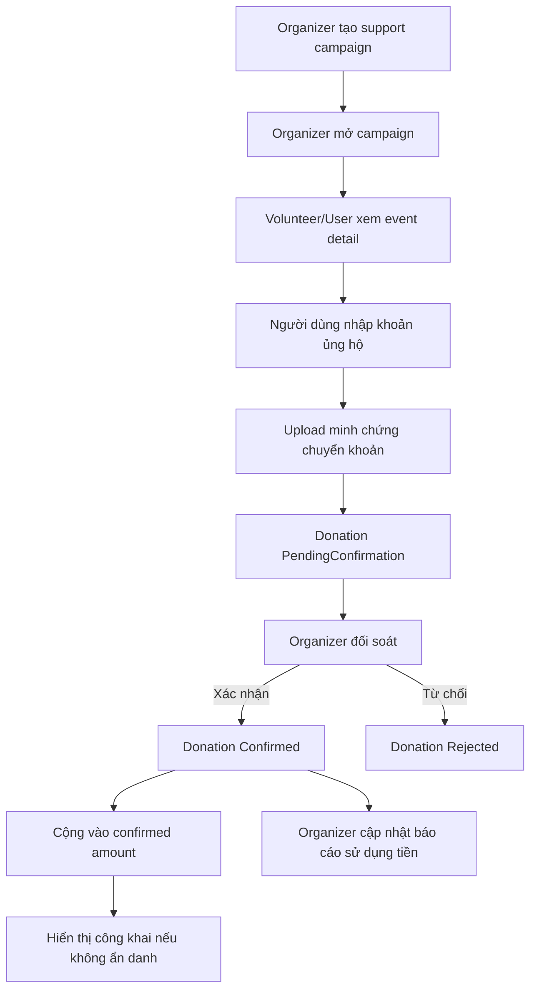
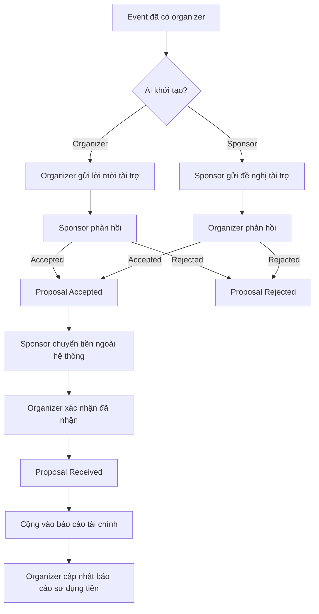

# Đặc tả luồng ủng hộ cá nhân và tài trợ doanh nghiệp - Volunteer Hub

## 1. Mục tiêu

Tài liệu này mô tả nghiệp vụ hỗ trợ tài chính cho sự kiện trong Volunteer Hub, gồm hai luồng tách biệt:

1. **Ủng hộ cá nhân**: dành cho volunteer hoặc user cá nhân đóng góp tiền vào một đợt kêu gọi hỗ trợ do organizer tạo.
2. **Tài trợ doanh nghiệp/tổ chức**: dành cho tài khoản sponsor làm việc chính thức với organizer qua đề nghị/mời tài trợ.

Mục tiêu thiết kế:

- Event không bắt buộc phải có ủng hộ hoặc tài trợ.
- Không biến hệ thống thành ví điện tử hoặc cổng thanh toán phức tạp ở giai đoạn đầu.
- Chỉ ghi nhận số tiền đã được organizer xác nhận là đã nhận.
- Phân biệt rõ khoản ủng hộ cá nhân nhỏ lẻ và tài trợ doanh nghiệp chính thức.
- Có báo cáo minh bạch sau khi nhận tiền và sau khi sử dụng tiền.

## 2. Actor

### 2.1. Volunteer/User cá nhân

Người dùng cá nhân có thể ủng hộ tiền vào một đợt kêu gọi hỗ trợ.

Người ủng hộ có thể:

- Xem các đợt kêu gọi đang mở của event.
- Nhập số tiền ủng hộ.
- Nhập tên hiển thị hoặc chọn ẩn danh.
- Gửi thông tin liên hệ tùy chọn.
- Upload minh chứng chuyển khoản.
- Theo dõi lịch sử ủng hộ của mình.
- Hủy khoản ủng hộ khi organizer chưa xác nhận.

### 2.2. Organizer

Nhà tổ chức event.

Organizer có thể:

- Tạo đợt kêu gọi ủng hộ tiền cho event.
- Mở/đóng/hủy đợt kêu gọi.
- Xem danh sách khoản ủng hộ.
- Xác nhận hoặc từ chối khoản ủng hộ.
- Gửi lời mời tài trợ đến sponsor.
- Chấp nhận/từ chối đề nghị tài trợ từ sponsor.
- Xác nhận đã nhận tiền tài trợ.
- Cập nhật báo cáo sử dụng tiền.

### 2.3. Sponsor

Tài khoản tổ chức/doanh nghiệp tài trợ chính thức.

Sponsor có thể:

- Xem danh sách event.
- Gửi đề nghị tài trợ cho event.
- Xem lời mời tài trợ từ organizer.
- Chấp nhận/từ chối lời mời.
- Hủy đề nghị khi chưa được chấp nhận.
- Theo dõi trạng thái tài trợ của mình.
- Xem báo cáo sử dụng tiền sau khi organizer cập nhật.

### 2.4. Admin

Admin không tham gia đối soát từng giao dịch hằng ngày, nhưng có quyền:

- Xem tổng quan tài chính.
- Export dữ liệu ủng hộ/tài trợ.
- Xem audit log.
- Xử lý khiếu nại hoặc hành vi gian lận.

## 3. Khái niệm chính

### 3.1. Support Campaign

Đợt kêu gọi ủng hộ tiền do organizer tạo trong phạm vi một event.

Dùng cho cá nhân/volunteer/user đóng góp tiền.

Thông tin chính:

- `EventId`.
- `Title`.
- `Description`.
- `TargetAmount`.
- `MinimumAmount`.
- `StartDate`.
- `EndDate`.
- `ReceiveInfo`: thông tin nhận chuyển khoản.
- `TransparencyNote`: ghi chú minh bạch.
- `Status`.
- `ConfirmedAmount`.
- `UsedAmount`.
- `ReportSummary`.

Trạng thái:

- `Draft`: bản nháp.
- `Open`: đang mở nhận ủng hộ.
- `Closed`: đã đóng.
- `Cancelled`: đã hủy.
- `Reported`: đã có báo cáo sử dụng tiền.

### 3.2. Individual Donation

Khoản ủng hộ cá nhân vào một support campaign.

Thông tin chính:

- `CampaignId`.
- `UserId`.
- `Amount`.
- `DisplayName`.
- `IsAnonymous`.
- `Phone`.
- `Email`.
- `Note`.
- `ProofImageUrl`.
- `Status`.

Trạng thái:

- `PendingConfirmation`: đã gửi, chờ organizer xác nhận đã nhận tiền.
- `Confirmed`: organizer xác nhận đã nhận.
- `Rejected`: organizer từ chối.
- `Cancelled`: người ủng hộ hủy trước khi được xác nhận.

### 3.3. Sponsor Account

Tài khoản doanh nghiệp/tổ chức tài trợ chính thức.

Sponsor khác volunteer ở điểm:

- Có danh tính tổ chức/doanh nghiệp.
- Có quan hệ làm việc hai chiều với organizer.
- Có thể có thỏa thuận tài trợ, quyền lợi truyền thông, ghi nhận thương hiệu.
- Khoản tài trợ thường lớn hơn và cần trạng thái đàm phán rõ ràng.

### 3.4. Sponsorship Proposal

Đề nghị hoặc lời mời tài trợ giữa organizer và sponsor.

Có hai chiều:

- `OrganizerRequest`: organizer mời sponsor tài trợ.
- `SponsorOffer`: sponsor chủ động đề nghị tài trợ event.

Thông tin chính:

- `EventId`.
- `SponsorId`.
- `Type`.
- `Title`.
- `Message`.
- `RequestedAmount` hoặc `OfferedAmount`.
- `ExpectedBenefits`.
- `ContactInfo`.
- `Status`.
- `UsedAmount`.
- `ReportSummary`.

Trạng thái:

- `Pending`: đang chờ bên còn lại phản hồi.
- `Accepted`: đã chấp nhận tài trợ, nhưng chưa xác nhận đã nhận tiền.
- `Rejected`: bị từ chối.
- `Cancelled`: bên tạo hủy khi còn pending.
- `Received`: organizer xác nhận đã nhận tiền.
- `Reported`: đã cập nhật báo cáo sử dụng tiền.

## 4. Nguyên tắc nghiệp vụ

### 4.1. Event vẫn chạy độc lập

Sự kiện không có sponsor hoặc không có donation vẫn hoạt động bình thường.

Các chi phí cơ bản có thể do organizer tự chuẩn bị. Donation/sponsorship là phần hỗ trợ thêm, không phải điều kiện bắt buộc để event được đăng ký, điểm danh hoặc hoàn tất.

### 4.2. Chỉ kêu gọi tiền ở giai đoạn hiện tại

Hiện vật khó kiểm soát tồn kho, chất lượng và bàn giao, nên giai đoạn hiện tại chỉ hỗ trợ tiền.

Nếu organizer muốn nhận hiện vật, có thể mô tả trong nội dung event ở ngoài phạm vi quản lý tài chính của hệ thống.

### 4.3. Tách cá nhân và doanh nghiệp

Volunteer muốn ủng hộ không cần tạo tài khoản sponsor. Volunteer/user dùng luồng donation.

Doanh nghiệp/tổ chức muốn tài trợ chính thức dùng tài khoản sponsor và luồng sponsorship proposal.

### 4.4. Không tự cộng tiền khi chưa xác nhận

Khoản donation/proposal chỉ được tính vào tổng tiền công khai khi:

- Donation ở trạng thái `Confirmed`.
- Sponsorship ở trạng thái `Received` hoặc `Reported`.

Các khoản pending không tính vào số tiền đã nhận.

## 5. Luồng ủng hộ cá nhân

### 5.1. Organizer tạo campaign

Điều kiện:

- Người dùng là organizer.
- Organizer sở hữu event.
- Event chưa completed hoặc chưa bị hủy.

Form tạo campaign:

- Tên đợt kêu gọi.
- Mô tả mục đích sử dụng.
- Mục tiêu tiền.
- Số tiền tối thiểu mỗi lượt ủng hộ.
- Thời gian bắt đầu/kết thúc.
- Thông tin nhận tiền.
- Ghi chú minh bạch.

Validation:

- `TargetAmount > 0`.
- `MinimumAmount >= 0`.
- `EndDate >= StartDate`.
- Không cho mở campaign đã hết hạn.
- Không cho donation vào campaign `Draft`, `Closed`, `Cancelled`.

### 5.2. Người dùng gửi donation

Điều kiện:

- Đã đăng nhập.
- Campaign đang `Open`.
- Campaign chưa hết hạn.
- Số tiền lớn hơn 0.
- Nếu campaign có minimum amount thì `Amount >= MinimumAmount`.

Form donation:

- Số tiền.
- Tên hiển thị.
- Checkbox ẩn danh.
- Số điện thoại tùy chọn.
- Email tùy chọn.
- Ghi chú tùy chọn.
- Ảnh minh chứng chuyển khoản.

Quy tắc hiển thị:

- Nếu `IsAnonymous = true`, danh sách công khai hiển thị "Ẩn danh".
- Nếu không ẩn danh, bắt buộc nhập tên hiển thị.
- Chỉ donation `Confirmed` mới xuất hiện trong danh sách công khai.

### 5.3. Organizer xác nhận donation

Organizer xem danh sách donation của campaign.

Organizer có thể:

- Confirm nếu đã nhận tiền.
- Reject nếu sai số tiền, sai nội dung, ảnh không hợp lệ hoặc không nhận được tiền.

Khi confirm:

- `Status = Confirmed`.
- Cập nhật số tiền đã xác nhận của campaign.
- Ghi audit log.

Khi reject:

- `Status = Rejected`.
- Có thể nhập lý do.
- Không cộng vào số tiền đã nhận.

### 5.4. Người dùng hủy donation

Người dùng được hủy khi donation còn `PendingConfirmation`.

Không được hủy khi:

- Donation đã `Confirmed`.
- Donation đã `Rejected`.

## 6. Luồng tài trợ doanh nghiệp

### 6.1. Organizer mời sponsor tài trợ

Điều kiện:

- Organizer sở hữu event.
- Event hợp lệ.
- Sponsor tồn tại và active.

Form:

- Chọn sponsor.
- Tiêu đề lời mời.
- Nội dung kêu gọi tài trợ.
- Số tiền mong muốn.
- Quyền lợi/ghi nhận dự kiến.
- Thông tin liên hệ.

Kết quả:

- Tạo proposal `Type = OrganizerRequest`.
- `Status = Pending`.
- Sponsor thấy lời mời trong màn `My Sponsorships`.

Sponsor có thể:

- Accept.
- Reject.

### 6.2. Sponsor đề nghị tài trợ event

Điều kiện:

- User role là `Sponsor`.
- Event tồn tại và có thể nhận tài trợ.

Form:

- Event muốn tài trợ.
- Tiêu đề đề nghị.
- Nội dung đề nghị.
- Số tiền đề nghị.
- Quyền lợi mong muốn nếu có.
- Thông tin liên hệ.

Kết quả:

- Tạo proposal `Type = SponsorOffer`.
- `Status = Pending`.
- Organizer thấy đề nghị trong trang quản lý event.

Organizer có thể:

- Accept.
- Reject.

### 6.3. Sau khi proposal được accepted

Accepted chỉ có nghĩa là hai bên đồng ý nguyên tắc.

Tiền chưa được tính vào báo cáo cho đến khi organizer bấm `Đã nhận tiền`.

Quy tắc:

- Sponsor không được hủy sau khi proposal đã accepted, trừ khi mở thêm luồng yêu cầu hủy có sự đồng ý của organizer.
- Organizer có thể đánh dấu `Received` sau khi đối soát.
- `Received` mới được tính vào tổng tài chính công khai.

### 6.4. Báo cáo sử dụng tiền tài trợ

Sau khi nhận tiền, organizer cập nhật:

- Số tiền đã sử dụng.
- Nội dung sử dụng.
- Ghi chú minh bạch.
- Ngày báo cáo.

Khi có báo cáo:

- `Status = Reported`.
- Event detail hiển thị báo cáo tài chính công khai.
- Admin export được dữ liệu.

## 7. Báo cáo tài chính công khai

Event detail nên hiển thị:

- Tổng ủng hộ cá nhân đã xác nhận.
- Tổng tài trợ doanh nghiệp đã nhận.
- Tổng tài chính đã ghi nhận.
- Danh sách campaign.
- Tiến độ campaign theo `ConfirmedAmount / TargetAmount`.
- Danh sách donor công khai nếu người ủng hộ không ẩn danh.
- Báo cáo sử dụng tiền nếu có.

Nếu chưa có khoản nào:

- Không hiển thị như lỗi.
- Có thể hiển thị text nhẹ: "Sự kiện chưa ghi nhận khoản ủng hộ hoặc tài trợ nào."

Nếu có tiền nhưng chưa có báo cáo sử dụng:

- Hiển thị tổng đã nhận.
- Ghi rõ: "Báo cáo sử dụng tiền sẽ được cập nhật sau khi ban tổ chức hoàn tất đối soát."

## 8. Trường hợp đặc biệt

### 8.1. Nhập số tiền âm hoặc bằng 0

Backend và frontend đều phải chặn.

Thông báo: "Số tiền phải lớn hơn 0."

### 8.2. Donation nhỏ hơn minimum

Nếu campaign có minimum amount, donation phải lớn hơn hoặc bằng minimum.

Thông báo: "Số tiền ủng hộ chưa đạt mức tối thiểu của đợt kêu gọi."

### 8.3. Campaign hết hạn

Không cho tạo donation mới.

Campaign có thể tự xem như đóng hoặc UI hiển thị "Đã hết hạn".

### 8.4. Campaign bị đóng/hủy

- `Closed`: không nhận donation mới, vẫn xem được dữ liệu đã xác nhận.
- `Cancelled`: không nhận donation mới, không nên hiển thị như campaign đang active.

### 8.5. Donation đã confirmed

Người dùng không được tự hủy.

Nếu cần hoàn tiền hoặc sửa sai, xử lý ngoài hệ thống và admin/organizer cập nhật thủ công theo quy trình mở rộng.

### 8.6. Sponsor hủy sau accepted

Không cho hủy trực tiếp.

Lý do:

- Accepted là cam kết giữa hai bên.
- Nếu cần hủy, phải có luồng thương lượng hoặc organizer reject/cancel theo quyền quản trị riêng.

### 8.7. User truy cập trái quyền

Backend phải chặn:

- Volunteer không được confirm donation.
- Sponsor không được confirm sponsor proposal thay organizer.
- Organizer không được sửa campaign của event không thuộc mình.
- Sponsor không được xem/chỉnh proposal không liên quan.
- Admin mới được export toàn hệ thống.

## 9. API tham chiếu

### 9.1. Support Campaign và Donation

- `GET /api/events/{eventId}/support-campaigns`: xem campaign của event.
- `POST /api/events/{eventId}/support-campaigns`: organizer tạo campaign.
- `PUT /api/support-campaigns/{campaignId}`: organizer sửa campaign.
- `PUT /api/support-campaigns/{campaignId}/open`: mở campaign.
- `PUT /api/support-campaigns/{campaignId}/close`: đóng campaign.
- `PUT /api/support-campaigns/{campaignId}/cancel`: hủy campaign.
- `POST /api/support-campaigns/{campaignId}/report`: báo cáo sử dụng tiền.
- `GET /api/support-campaigns/{campaignId}/donations`: organizer xem donations.
- `POST /api/support-campaigns/{campaignId}/donations`: user gửi donation.
- `GET /api/donations/my`: user xem donation của mình.
- `PUT /api/donations/{donationId}/confirm`: organizer xác nhận.
- `PUT /api/donations/{donationId}/reject`: organizer từ chối.
- `PUT /api/donations/{donationId}/cancel`: user hủy khi còn pending.

### 9.2. Sponsorship Proposal

- `GET /api/sponsors/users`: organizer lấy danh sách sponsor.
- `GET /api/events/{eventId}/sponsorship-proposals`: organizer xem proposal theo event.
- `GET /api/sponsorship-proposals/my`: sponsor xem proposal của mình.
- `POST /api/events/{eventId}/sponsorship-proposals/organizer-request`: organizer mời sponsor.
- `POST /api/events/{eventId}/sponsorship-proposals/sponsor-offer`: sponsor đề nghị tài trợ.
- `PUT /api/sponsorship-proposals/{proposalId}/accept`: bên nhận lời chấp nhận.
- `PUT /api/sponsorship-proposals/{proposalId}/reject`: bên nhận lời từ chối.
- `PUT /api/sponsorship-proposals/{proposalId}/received`: organizer xác nhận đã nhận tiền.
- `PUT /api/sponsorship-proposals/{proposalId}/cancel`: bên tạo hủy khi pending.
- `POST /api/sponsorship-proposals/{proposalId}/report`: organizer báo cáo sử dụng tiền.

### 9.3. Admin finance

- `GET /api/admin/finance/overview`: tổng quan tài chính.
- `GET /api/admin/export/finance`: export dữ liệu tài chính.
- `GET /api/admin/audit-logs`: audit log thao tác nhạy cảm.

## 10. UI cần có

### 10.1. Event detail

- Hiển thị campaign đang mở.
- Nút ủng hộ.
- Tiến độ campaign.
- Danh sách donor công khai đã confirmed.
- Tổng tài chính đã ghi nhận.
- Báo cáo sử dụng tiền nếu có.

### 10.2. Manage event

- Tab hoặc section `Ủng hộ`.
- Tạo/sửa/mở/đóng/hủy campaign.
- Xem donation pending.
- Confirm/reject donation.
- Cập nhật báo cáo sử dụng tiền.
- Section `Tài trợ doanh nghiệp`.
- Gửi lời mời sponsor.
- Xem sponsor offer.
- Accept/reject/received/report proposal.

### 10.3. My Donations

- User xem lịch sử donation.
- Trạng thái từng khoản.
- Hủy donation pending.
- Link về event/campaign.

### 10.4. My Sponsorships

- Sponsor xem proposal mình liên quan.
- Phân biệt lời mời từ organizer và đề nghị mình tạo.
- Accept/reject/cancel tùy trạng thái và vai trò.
- Xem báo cáo sử dụng tiền sau khi organizer cập nhật.

### 10.5. Admin Export

- Export finance JSON/CSV.
- Có tổng quan campaign, donation, proposal, amount, status, report.

## 11. Tiêu chí hoàn thành

Luồng được coi là hoàn chỉnh khi:

- Organizer tạo campaign và mở campaign được.
- User gửi donation hợp lệ được.
- Số tiền âm, bằng 0, nhỏ hơn minimum bị chặn.
- Campaign hết hạn/đóng/hủy không nhận donation mới.
- Organizer confirm donation thì số tiền mới xuất hiện trong báo cáo.
- User hủy donation pending được, không hủy donation confirmed.
- Organizer mời sponsor tài trợ được.
- Sponsor chủ động đề nghị tài trợ được.
- Bên nhận accept/reject đúng quyền.
- Sponsor không hủy trực tiếp sau accepted.
- Organizer đánh dấu received thì tiền tài trợ mới tính vào tổng công khai.
- Organizer cập nhật report và event detail/admin export hiển thị được.
- Truy cập trái quyền từng endpoint bị backend chặn.
- Desktop/mobile không vỡ layout ở event detail, manage event, my donations, my sponsorships, admin export.
